# 🏛️ Nifty 200 Algorithmic Trading System

**Complete algorithmic trading framework for Indian markets** — focused on **Nifty 200** with realistic backtesting, high-performance Market Profile (Python + Rust), dynamic Half-Kelly portfolio simulation, and a beautiful Streamlit dashboard.

---

## ✨ Key Features

| Feature | Description |
|---|---|
| 🦀 **Rust Market Profile** | TPO, Value Area, POC, Single Prints — **102x faster** than Python |
| 📊 **Modular Backtester** | Clean `Strategy` base class, easy to extend |
| 💰 **Portfolio Simulator** | Half-Kelly sizing, rolling window, Zerodha brokerage/STT, max positions |
| 📈 **Streamlit Dashboard** | Head-to-head comparison, volume profiles, trade charts, risk metrics |
| 📡 **Data Pipeline** | Kite Connect + yfinance, multi-timeframe (1m → weekly), 200 stocks |
| ⚖️ **Reality-First** | Real fees, slippage modeling, cash reserves, max daily trade limits |

---

## 🏗️ Architecture

```mermaid
graph LR
    A[Data Fetchers] --> B[Raw CSVs]
    B --> C[Resamplers]
    C --> D[Multi-TF Data]
    D --> E[Backtest Engine]
    D --> F[Market Profile Engine]
    F -->|Rust 🦀| G[TPO/POC/VA Profiles]
    G --> E
    E --> H[Trade Signals CSV]
    H --> I[Portfolio Simulator]
    I -->|Kelly + Fees| J[Equity Curve]
    H --> K[Streamlit Dashboard]
    J --> K
    G --> K
```



## 📁 Project Structure

```
Trading/
├── trading/                    # Main package
│   ├── core/                   # Engine & models
│   │   ├── backtest_engine.py  # Backtester + Strategy base class
│   │   ├── market_profile.py   # Python Market Profile engine
│   │   └── portfolio_simulator.py
│   ├── strategies/             # Trading strategies
│   │   ├── base.py             # SMA, RSI example strategies
│   │   ├── minervini.py        # Mark Minervini trend template
│   │   ├── hybrid.py           # MP-filtered Minervini
│   │   └── value_area.py       # Intraday Value Area / Parallel Activity
│   └── utils/
│       └── auth.py             # Kite Connect authentication
├── scripts/                    # Standalone utilities
│   ├── dashboard.py            # Streamlit dashboard
│   ├── run_backtest.py         # Single strategy runner
│   ├── run_all_backtests.py    # Batch runner
│   ├── fetch_nifty_200_data.py # Data fetcher
│   ├── resample_nifty_data.py  # Multi-TF resampler
│   └── ...
├── rust_mp/                    # Rust Market Profile extension
│   ├── Cargo.toml
│   └── src/lib.rs              # PyO3 bindings
├── data/                       # OHLCV data (gitignored except daily)
│   ├── nifty_200_daily/        # ✅ In repo
│   ├── nifty_200_30min/        # gitignored
│   └── ...
├── tests/
├── configs/
├── pyproject.toml
├── requirements.txt
├── .env.example
└── README.md
```

---

## 🚀 Installation

### Prerequisites

- Python 3.9+
- Rust toolchain ([rustup.rs](https://rustup.rs/))
- Kite Connect API credentials (optional, for live data)

### Setup

```bash
# Clone
git clone https://github.com/sagartarar/Trading.git
cd Trading

# Create virtual environment
python3 -m venv venv
source venv/bin/activate

# Install Python dependencies
pip install -r requirements.txt

# Build Rust Market Profile engine (102x faster!)
cd rust_mp
maturin develop --release
cd ..

# Configure API keys (optional)
cp .env.example .env
# Edit .env with your Kite API credentials
```

---

## ⚡ Quick Start

```bash
# 1. Run all backtests
python scripts/run_all_backtests.py

# 2. Launch dashboard
streamlit run scripts/dashboard.py

# 3. Run portfolio simulation (₹5L, Kelly sizing, Zerodha fees)
python trading/core/portfolio_simulator.py \
  --trades minervini_trades_daily.csv \
  --capital 500000 --mode delivery
```

---

## 📊 Strategies Included

### 🏛️ Minervini (Swing)
Mark Minervini's trend template on daily charts. SMA 50/150/200 alignment, 52-week high proximity, volume confirmation. **Best performer: +1,035% over 5 years**.

### 🧬 Hybrid (MP-Filtered)
Minervini entries filtered through Market Profile context (Value Area alignment, day type, open type). Lower trade frequency, **best Sharpe (1.82)** and **lowest drawdown (7.4%)**.

### 📐 Parallel Activity (Intraday)
Value Area, single print retracement, and failed range extension setups on 30-minute charts. Fixed capital (no compounding). Intraday exits.

---

## 🦀 Rust Market Profile Engine

The `rust_mp` module provides a **102x speedup** over the Python Market Profile implementation:

| Metric | Python | Rust |
|---|---|---|
| Single stock (20K bars) | 0.957s | **0.009s** |
| All 196 stocks (5.7M bars) | ~188s | **35.8s** |

```python
import rust_mp

profiles = rust_mp.build_profiles(
    dates, opens, highs, lows, closes, volumes, tick_size=1.0
)
# Returns list of DailyProfile objects with POC, VAH, VAL, IB, day_type, etc.
```

---

## 💰 Portfolio Simulator

Realistic simulation with:
- **Half-Kelly** position sizing (rolling 20-trade lookback, bounds 2–25%)
- **Zerodha charges** — brokerage, STT, DP charges, API fees
- **Concurrent position limits** — max 5 positions (swing), max 3 trades/day (intraday)
- **Cash reserve checks** — no margin trading

### 5-Year Results (₹5L starting capital)

| Strategy | Final Equity | CAGR | Sharpe | Max DD |
|---|---|---|---|---|
| 🏛️ Minervini | **₹56,74,225** | **63.8%** | 1.80 | 18.2% |
| 🧬 Hybrid | ₹9,30,461 | 13.5% | **1.82** | **7.4%** |
| 📐 PA | ₹3,89,964 | -4.9% | -3.57 | 22.0% |

---

## 🔧 Development

### Adding a New Strategy

```python
from trading.core.backtest_engine import Strategy

class MyStrategy(Strategy):
    def init(self, df):
        df["signal_col"] = ...  # Your indicator logic
        return df

    def check_entry(self, row, i, df):
        if row["signal_col"] > threshold:
            return True
        return False

    def check_exit(self, row, i, df, entry_price):
        if row["close"] < entry_price * 0.95:  # 5% stop
            return True, "Stop Loss"
        return False, ""
```

### Running Tests
```bash
python -m pytest tests/
```

### Code Style
```bash
pip install black ruff
black .
ruff check .
```

---

## 🗺️ Roadmap

- [ ] Live trading connector (Kite Connect WebSocket)
- [ ] Optuna hyperparameter optimization
- [ ] Walk-forward analysis / Monte Carlo simulation
- [ ] Docker + GitHub Actions CI
- [ ] DuckDB/ArcticDB for data storage
- [ ] More Market Profile strategies
- [ ] Options chain integration

---

## 📜 License

MIT License — see [LICENSE](LICENSE) for details.

---

Made with ❤️ by [Sagar Tarar](https://github.com/sagartarar) for serious Indian algo traders.

**⭐ Star if you find it useful!**
